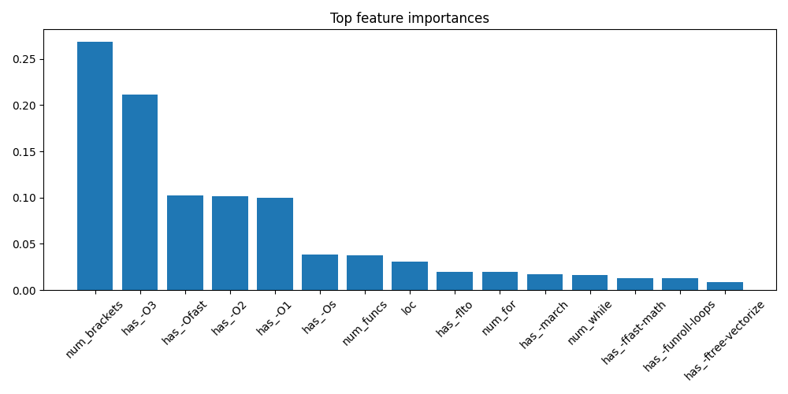

# Project AUXESIS  
### ML-Guided Compiler Flag Recommender (AutoFlag Finder)

Compilers like `g++` have dozens of optimization flags (`-O2`, `-Ofast`, `-funroll-loops`, …).  
Different programs respond very differently to each combination, and brute-forcing all flag combos is expensive.

### Why this matters?

As programs get more compute-intensive, compiler optimizations directly impact performance.
Choosing the right compiler flags can reduce runtime by 30–60% — which is far beyond what the default settings achieve.

### Why brute-force is costly?
Compilers like `g++` expose dozens of optimization flags, and hundreds of valid combinations — many of which interact in nonlinear ways.
Testing everything manually requires hours of benchmarking per program, making it impractical for real development.

### Why ML prediction is useful?
Instead of brute-forcing every flag combination, we learn from previous runs.
By training a model on program features + runtime + flags, we build a surrogate performance model that predicts which flag combo is likely to be fastest — in milliseconds, without expensive trial-and-error.

**AutoFlag Finder** is a small research project that:

> Learns how different C++ programs respond to compiler flags,  
> then *recommends good flag combinations* for **new, unseen code**.

It does this by:
- Automatically benchmarking C++ programs under many flag combos
- Extracting static features from the source code
- Measuring a dynamic baseline (`-O3` runtime)
- Training an XGBoost model to predict **relative speedup**
- Ranking candidate flag combinations and optionally verifying them by actually compiling and running.

---

## 📁 Project Structure

```text
autoflag-finder/
├─ Dataset/
│   ├─ results.json         # raw benchmark runs (program, flags, times)
│   ├─ results_clean.csv    # cleaned from results.json
│   ├─ features.csv         # static code features per program
│   └─ dataset.csv          # merged features + runtimes (training data)
├─ Model/
│   └─ xgb_model_main.joblib     # trained XGBoost surrogate model
├─ src/
│   ├─ config.py            # paths: DATA_DIR, MODEL_DIR, TEST_DIR
│   ├─ data_load.py         # results.json -> results_clean.csv
│   ├─ feature_extract.py   # .cpp -> static features
│   ├─ merge_prepare.py     # merge features + runtimes -> dataset.csv
│   ├─ train_test.py        # train XGB model, print metrics, save model
│   ├─ xgb_eval.py          # extra evaluation: LOO ranking metrics
│   ├─ run_compile.py       # compile + time a program under given flags
│   └─ recommend_flags.py   # MAIN CLI: recommend & verify flags
├─ test_prog/
│   ├─ matmul.cpp
│   ├─ sort_big.cpp
│   ├─ pointer_chase.cpp
│   ├─ convolution.cpp
│   ├─ string_parse.cpp
│   ├─ sieve_primes.cpp
│   ├─ transpose.cpp
│   ├─ prefix_sum.cpp
│   ├─ fibonacci_recursion.cpp
│   └─ branch_classifier.cpp
├─ Notebook/
│   └─ compiler_flag_analysis.ipynb   # exploratory analysis (optional)
├─ README.md
├─ requirements.txt
└─ .gitignore
```
---
## ⚙️ Installation
```
### 1. Clone the repo
git clone https://github.com/<your-username>/autoflag-finder.git
cd autoflag-finder

### 2. Create & activate virtualenv (Linux/WSL)
python3 -m venv .venv
source .venv/bin/activate

### 3. Install dependencies
pip install -r requirements.txt
```
---

## 🧪 Data Pipeline

### 1. Raw benchmarks → cleaned CSV

data/results.json is produced by repeatedly calling run_compile.py
on different test_prog/*.cpp with different flag combinations.
```
python3 src/data_load.py
# -> data/results_clean.csv
```

### 2. Static feature extraction
Features include:

>num_for, num_while, num_if,
>num_funcs, num_brackets, loc
>crude program type tags for some benchmarks
```
python3 src/feature_extract.py
# -> data/features.csv
```
### 3. Merge into training dataset
Each row = (program, flag combo, runtime, baseline_O3_time, static features, one-hot flags).
```
python3 src/merge_prepare.py
# -> data/dataset.csv
```
## Quick setup commands-
```
git clone https://github.com/Rehxn2k06/autoflag-finder.git
cd autoflag-finder
python3 -m venv .venv
source .venv/bin/activate
pip install -r requirements.txt
python3 src/recommend_flags.py test_prog/matmul.cpp --max-size 2 --topk 3 --verify
```
---
## 🧠 Modeling

We train a surrogate model that predicts relative runtime:

### 𝑦=log(runtime)−log(baseline_O3_time)

So the model learns “how much slower/faster than -O3” each flag combo is for a given program.

Model: XGBoost Regressor (XGBRegressor) on:

1)Static code features: loops, ifs, functions, brackets, LOC

2)baseline_O3_time and baseline_log

3)Binary features has_-O3, has_-Ofast, has_-funroll-loops, …

```
#Train script:
python3 src/train_test.py

#Typical output on this dataset:
R² on runtime scale: ~0.90
RMSE on runtime scale: ~0.03 seconds
Top features:
  num_brackets, has_-O3, has_-O2, has_-O1, has_-Ofast, ...
Saved XGB model -> Model/xgb_model.joblib


#For deeper evaluation (per-program ranking):
python3 src/xgb_eval.py
```
Example (approximate) result:

Test R²: ~0.91

Test RMSE: ~0.029 s

LOO Spearman (ranking quality): ~0.69

LOO top-3 hits: 3 / 11 programs (XGBoost)
versus 1 / 11 for a RandomForest baseline.

---
## 🚀 Using the Flag Recommender

Main entry point:
```
python3 src/recommend_flags.py <path/to/source.cpp> --max-size 2 --topk 3 --verify
```
Example:
```
python3 src/recommend_flags.py test_prog/matmul.cpp --max-size 2 --topk 3 --verify
```

Output looks like:
```
Measuring baseline with -O3 (5 runs, median)...
Baseline (-O3) median runtime: 0.057682 s

Top 3 predicted combos for matmul.cpp:
  -O3 -Ofast        --> predicted runtime 0.026008 s (log_rel -0.7965)
  -O2 -Ofast        --> predicted runtime 0.029284 s (log_rel -0.6779)
  -O3 -Os           --> predicted runtime 0.032365 s (log_rel -0.5779)

Verifying by compiling & running the top combos (this will run them):
Compiling with: ['-O3', '-Ofast']
 Program output (first line):
['C[0]=600\nMatMul took 0.0536164']
 Measured time: 0.053616 s
----------------------------------------
...
```
So the recommender:

Measures a baseline runtime using -O3

Enumerates candidate flag combos (up to --max-size)

Predicts relative runtime using the XGB model

Ranks the combos and prints top-k

Optionally recompiles and times them for verification (--verify)

---
## Demo Run/Result in my machine

  


 📊 **Model Insights on my Machine**  


  


---
## 📊 Limitations & Future Work

>Dataset is small: ~11 benchmark programs × selected flag combos.

>Model is good at interpolation on similar programs, but not guaranteed optimal on arbitrary code.

>Current features are mostly simple counts and flags; a real system could use:

>true AST/CFG features

>basic block statistics

>hardware counters

Future directions:

>Add more diverse benchmarks (I/O-heavy, SIMD-heavy, etc.)

>Use pairwise ranking loss instead of regression

>Integrate with a UI (e.g., Streamlit) for interactive exploration

>Extend to Clang / -march variants / profile-guided optimizations


```
NOTE-  
This system does not brute-force compiler flags.

It learns program behavior — builds a surrogate model —and recommends good optimization flags in milliseconds instead of running hours of benchmarks.
```

---
## 🔗 Authors
**Rehan Imtiyaj Mulla**  
Data Science Undergraduate | Machine learning Engineer | Aspiring Quantitative Analyst  
[LinkedIn](https://www.linkedin.com/in/rehan-mulla-8719b62b8/)  
[GitHub](https://github.com/Rehxn2k06)
